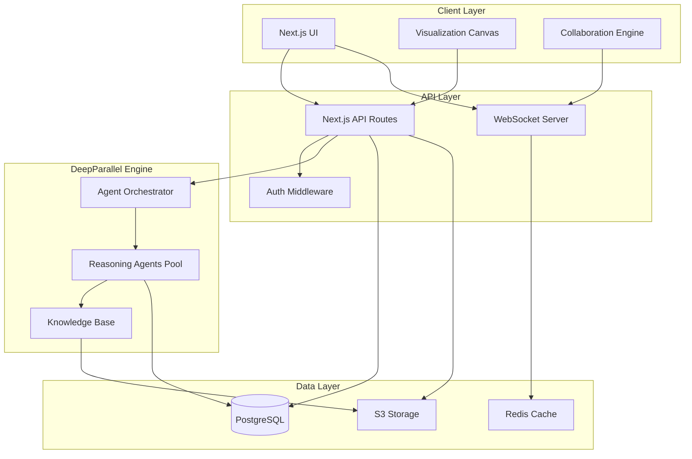
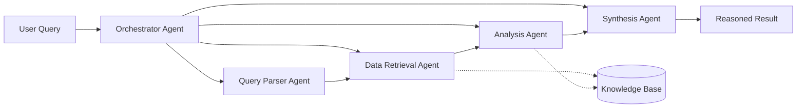
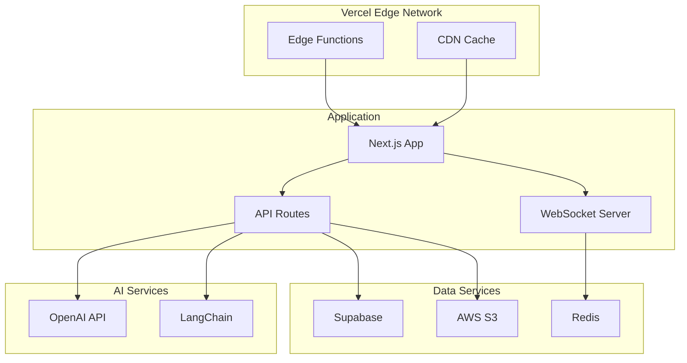

# Mycological Work Bench - Design Document

## Overview

The Mycological Work Bench is a Next.js-based scientific computing platform that combines modern web technologies with AI-powered reasoning capabilities. The system architecture emphasizes real-time collaboration, high-performance data visualization, and explainable AI analysis through the DeepParallel AgBiotech Reasoning Engine.

### Technology Stack

- **Frontend**: Next.js 14 (App Router), React 18, TypeScript
- **Styling**: Tailwind CSS with scientific visualization theme
- **State Management**: Zustand for global state, React Query for server state
- **Visualization**: D3.js, Three.js for 3D molecular structures, Plotly for scientific charts
- **AI/ML**: OpenAI API for reasoning engine, LangChain for agent orchestration
- **Real-time**: WebSockets (Socket.io) for collaboration
- **Data Storage**: Supabase (PostgreSQL) for structured data, S3 for file storage
- **Authentication**: NextAuth.js with institutional SSO support

## Architecture

### High-Level System Architecture



### DeepParallel Engine Architecture

The reasoning engine uses a multi-agent system where specialized agents work in parallel:



## Components and Interfaces

### 1. Research Session Manager

**Location**: `app/workbench/page.tsx`, `components/session-manager.tsx`

**Purpose**: Manages research session lifecycle and workspace organization

**Key Features**:
- Session dashboard with grid/list views
- Quick actions (create, clone, archive)
- Search and filter by tags, date, collaborators
- Session templates for common workflows

**State Management**:
```typescript
interface SessionStore {
  sessions: ResearchSession[];
  activeSession: ResearchSession | null;
  loading: boolean;
  createSession: (name: string, template?: string) => Promise<void>;
  loadSession: (id: string) => Promise<void>;
  updateSession: (id: string, updates: Partial<ResearchSession>) => Promise<void>;
  deleteSession: (id: string) => Promise<void>;
}
```

### 2. Data Import Module

**Location**: `components/data-import/`, `lib/parsers/`

**Purpose**: Handles multi-format data ingestion and validation

**Supported Formats**:
- CSV/TSV: Experimental data, growth curves
- JSON: Structured metadata, API responses
- FASTA: DNA/protein sequences
- GenBank: Annotated genomic data
- Excel: Legacy experimental data

**Parser Architecture**:
```typescript
interface DataParser {
  format: string;
  validate: (file: File) => Promise<ValidationResult>;
  parse: (file: File) => Promise<ParsedData>;
  extractMetadata: (data: ParsedData) => Metadata;
}

// Streaming parser for large files
class StreamingParser implements DataParser {
  async *parseChunks(file: File): AsyncGenerator<DataChunk> {
    // Process file in chunks to avoid memory issues
  }
}
```

### 3. Hypothesis Testing Interface

**Location**: `components/hypothesis/`, `lib/reasoning/`

**Purpose**: Structured hypothesis formulation and AI-powered testing

**UI Components**:
- Hypothesis builder form with variable definition
- Condition editor with logical operators
- Expected outcome specification
- Test configuration (confidence threshold, data sources)

**Reasoning Flow**:
```typescript
interface HypothesisTest {
  id: string;
  hypothesis: HypothesisModel;
  status: 'pending' | 'running' | 'completed' | 'failed';
  results?: {
    confidence: number;
    evidence: Evidence[];
    reasoning: ReasoningTrace;
    citations: Citation[];
  };
}

async function testHypothesis(
  hypothesis: HypothesisModel,
  dataCorpus: DataCorpus
): Promise<HypothesisTest> {
  // 1. Parse hypothesis into testable components
  // 2. Retrieve relevant data from corpus
  // 3. Spawn parallel reasoning agents
  // 4. Aggregate results and generate confidence score
  // 5. Build reasoning trace with citations
}
```

### 4. Experiment Pipeline Builder

**Location**: `components/pipeline/`, `lib/pipeline-engine/`

**Purpose**: Visual workflow designer for multi-step analyses

**Pipeline Steps Library**:
- Data preprocessing (normalization, filtering)
- Statistical analysis (t-tests, ANOVA, regression)
- Sequence alignment (BLAST, multiple alignment)
- Phylogenetic analysis (tree building, bootstrap)
- Machine learning (clustering, classification)
- Custom Python/R scripts

**Visual Builder**:
```typescript
interface PipelineNode {
  id: string;
  type: string;
  position: { x: number; y: number };
  data: {
    label: string;
    parameters: Record<string, any>;
    inputs: Port[];
    outputs: Port[];
  };
}

interface PipelineEdge {
  id: string;
  source: string;
  target: string;
  sourceHandle: string;
  targetHandle: string;
}

// Uses React Flow for visual editing
```

**Execution Engine**:
```typescript
class PipelineExecutor {
  async execute(pipeline: Pipeline, data: DataSet): Promise<PipelineResult> {
    const graph = this.buildDAG(pipeline);
    const sorted = this.topologicalSort(graph);
    
    for (const nodeId of sorted) {
      const node = pipeline.nodes.find(n => n.id === nodeId);
      const inputs = this.getNodeInputs(node, executedNodes);
      const result = await this.executeNode(node, inputs);
      executedNodes.set(nodeId, result);
    }
    
    return this.aggregateResults(executedNodes);
  }
}
```

### 5. Visualization Canvas

**Location**: `components/visualization/`, `lib/viz/`

**Purpose**: Interactive scientific data visualization

**Visualization Types**:

**Phylogenetic Trees**:
```typescript
// Uses D3.js for tree layout
class PhylogeneticTreeViz {
  render(tree: PhylogeneticTree, container: HTMLElement) {
    const layout = d3.tree().size([height, width]);
    const root = d3.hierarchy(tree);
    const nodes = layout(root);
    
    // Render nodes and edges with interactive tooltips
    // Support zoom, pan, node selection
    // Color-code by taxonomy, bootstrap values
  }
}
```

**Growth Curves**:
```typescript
// Uses Plotly for interactive charts
class GrowthCurveViz {
  render(data: TimeSeriesData[], container: HTMLElement) {
    Plotly.newPlot(container, {
      data: data.map(series => ({
        x: series.timepoints,
        y: series.values,
        type: 'scatter',
        mode: 'lines+markers',
        name: series.label
      })),
      layout: {
        xaxis: { title: 'Time (hours)' },
        yaxis: { title: 'OD600' }
      }
    });
  }
}
```

**3D Molecular Structures**:
```typescript
// Uses Three.js for 3D rendering
class MolecularStructureViz {
  render(structure: MolecularStructure, container: HTMLElement) {
    const scene = new THREE.Scene();
    const camera = new THREE.PerspectiveCamera(75, width/height, 0.1, 1000);
    const renderer = new THREE.WebGLRenderer({ antialias: true });
    
    // Render atoms as spheres, bonds as cylinders
    // Support rotation, zoom, atom selection
    // Color-code by element type
  }
}
```

### 6. DeepParallel Reasoning Engine

**Location**: `lib/reasoning/`, `app/api/reasoning/`

**Purpose**: AI-powered parallel analysis and hypothesis testing

**Agent Types**:

```typescript
abstract class ReasoningAgent {
  abstract type: string;
  abstract execute(task: Task): Promise<AgentResult>;
}

class DataRetrievalAgent extends ReasoningAgent {
  type = 'retrieval';
  
  async execute(task: Task): Promise<AgentResult> {
    // Query knowledge base and data corpus
    // Use vector embeddings for semantic search
    // Return relevant data with relevance scores
  }
}

class AnalysisAgent extends ReasoningAgent {
  type = 'analysis';
  
  async execute(task: Task): Promise<AgentResult> {
    // Perform statistical or computational analysis
    // Use LLM for pattern recognition
    // Generate insights and confidence scores
  }
}

class SynthesisAgent extends ReasoningAgent {
  type = 'synthesis';
  
  async execute(task: Task): Promise<AgentResult> {
    // Combine results from multiple agents
    // Generate coherent reasoning narrative
    // Cite sources and provide evidence
  }
}
```

**Orchestrator**:
```typescript
class AgentOrchestrator {
  private agentPool: Map<string, ReasoningAgent[]>;
  
  async processQuery(query: string, context: Context): Promise<ReasoningResult> {
    // 1. Parse query and determine required agents
    const plan = await this.planExecution(query, context);
    
    // 2. Spawn agents in parallel where possible
    const tasks = plan.tasks.map(task => 
      this.executeTask(task, this.selectAgent(task.type))
    );
    
    // 3. Await all parallel tasks
    const results = await Promise.all(tasks);
    
    // 4. Synthesize final result
    const synthesis = await this.synthesize(results);
    
    return {
      answer: synthesis.answer,
      confidence: synthesis.confidence,
      reasoning: synthesis.trace,
      citations: synthesis.citations
    };
  }
}
```

### 7. Collaboration System

**Location**: `lib/collaboration/`, `app/api/collaboration/`

**Purpose**: Real-time multi-user collaboration

**WebSocket Events**:
```typescript
// Server-side event handlers
io.on('connection', (socket) => {
  socket.on('join-session', (sessionId) => {
    socket.join(sessionId);
    io.to(sessionId).emit('user-joined', socket.userId);
  });
  
  socket.on('session-update', (sessionId, update) => {
    // Apply operational transformation for conflict resolution
    const transformed = applyOT(update, sessionState);
    io.to(sessionId).emit('session-updated', transformed);
  });
  
  socket.on('cursor-move', (sessionId, position) => {
    socket.to(sessionId).emit('cursor-moved', {
      userId: socket.userId,
      position
    });
  });
});
```

**Conflict Resolution**:
```typescript
// Operational Transformation for concurrent edits
class OTEngine {
  transform(op1: Operation, op2: Operation): [Operation, Operation] {
    // Transform operations to maintain consistency
    // Handle insert, delete, update operations
    // Preserve user intent while resolving conflicts
  }
}
```

### 8. Natural Language Query Interface

**Location**: `components/query-interface.tsx`, `lib/nlp/`

**Purpose**: Natural language access to data and analyses

**Query Processing Pipeline**:
```typescript
class NLQueryProcessor {
  async process(query: string): Promise<QueryResult> {
    // 1. Parse natural language query
    const parsed = await this.parseQuery(query);
    
    // 2. Identify intent (search, analyze, visualize, etc.)
    const intent = await this.classifyIntent(parsed);
    
    // 3. Extract entities (species names, genes, conditions)
    const entities = await this.extractEntities(parsed);
    
    // 4. Generate structured query
    const structured = this.buildStructuredQuery(intent, entities);
    
    // 5. Execute query using appropriate system
    const result = await this.executeQuery(structured);
    
    // 6. Format response in natural language
    return this.formatResponse(result);
  }
}
```

## Data Models

### Core Data Structures

```typescript
interface ResearchSession {
  id: string;
  name: string;
  description: string;
  owner: string;
  collaborators: Collaborator[];
  created: Date;
  modified: Date;
  tags: string[];
  experiments: Experiment[];
  datasets: Dataset[];
  hypotheses: HypothesisModel[];
}

interface Dataset {
  id: string;
  name: string;
  format: string;
  size: number;
  uploaded: Date;
  metadata: Record<string, any>;
  records: DataRecord[];
}

interface Experiment {
  id: string;
  name: string;
  pipeline: Pipeline;
  inputs: Dataset[];
  outputs: Dataset[];
  status: 'draft' | 'running' | 'completed' | 'failed';
  started?: Date;
  completed?: Date;
  results?: ExperimentResults;
}

interface HypothesisModel {
  id: string;
  statement: string;
  variables: Variable[];
  conditions: Condition[];
  expectedOutcome: string;
  testResults?: HypothesisTest;
}

interface ReasoningTrace {
  steps: ReasoningStep[];
  confidence: number;
  evidence: Evidence[];
  citations: Citation[];
}

interface ReasoningStep {
  agent: string;
  action: string;
  input: any;
  output: any;
  reasoning: string;
  confidence: number;
}
```

### Database Schema

```sql
-- Research Sessions
CREATE TABLE research_sessions (
  id UUID PRIMARY KEY DEFAULT gen_random_uuid(),
  name TEXT NOT NULL,
  description TEXT,
  owner_id UUID REFERENCES users(id),
  created_at TIMESTAMPTZ DEFAULT NOW(),
  updated_at TIMESTAMPTZ DEFAULT NOW(),
  tags TEXT[],
  settings JSONB
);

-- Datasets
CREATE TABLE datasets (
  id UUID PRIMARY KEY DEFAULT gen_random_uuid(),
  session_id UUID REFERENCES research_sessions(id) ON DELETE CASCADE,
  name TEXT NOT NULL,
  format TEXT NOT NULL,
  size BIGINT,
  uploaded_at TIMESTAMPTZ DEFAULT NOW(),
  metadata JSONB,
  storage_path TEXT
);

-- Experiments
CREATE TABLE experiments (
  id UUID PRIMARY KEY DEFAULT gen_random_uuid(),
  session_id UUID REFERENCES research_sessions(id) ON DELETE CASCADE,
  name TEXT NOT NULL,
  pipeline JSONB NOT NULL,
  status TEXT NOT NULL,
  started_at TIMESTAMPTZ,
  completed_at TIMESTAMPTZ,
  results JSONB
);

-- Hypotheses
CREATE TABLE hypotheses (
  id UUID PRIMARY KEY DEFAULT gen_random_uuid(),
  session_id UUID REFERENCES research_sessions(id) ON DELETE CASCADE,
  statement TEXT NOT NULL,
  model JSONB NOT NULL,
  test_results JSONB,
  created_at TIMESTAMPTZ DEFAULT NOW()
);

-- Reasoning Traces
CREATE TABLE reasoning_traces (
  id UUID PRIMARY KEY DEFAULT gen_random_uuid(),
  hypothesis_id UUID REFERENCES hypotheses(id),
  experiment_id UUID REFERENCES experiments(id),
  trace JSONB NOT NULL,
  created_at TIMESTAMPTZ DEFAULT NOW()
);

-- Collaborators
CREATE TABLE session_collaborators (
  session_id UUID REFERENCES research_sessions(id) ON DELETE CASCADE,
  user_id UUID REFERENCES users(id) ON DELETE CASCADE,
  role TEXT NOT NULL,
  joined_at TIMESTAMPTZ DEFAULT NOW(),
  PRIMARY KEY (session_id, user_id)
);

-- Knowledge Base (for vector search)
CREATE TABLE knowledge_base (
  id UUID PRIMARY KEY DEFAULT gen_random_uuid(),
  content TEXT NOT NULL,
  embedding vector(1536),
  metadata JSONB,
  source TEXT,
  created_at TIMESTAMPTZ DEFAULT NOW()
);

CREATE INDEX ON knowledge_base USING ivfflat (embedding vector_cosine_ops);
```

## Error Handling

### Error Categories

1. **Data Validation Errors**: Invalid file formats, malformed data
2. **Computation Errors**: Pipeline execution failures, timeout errors
3. **AI/Reasoning Errors**: LLM API failures, low confidence results
4. **Collaboration Errors**: Sync conflicts, connection drops
5. **Storage Errors**: Upload failures, quota exceeded

### Error Handling Strategy

```typescript
class WorkbenchError extends Error {
  constructor(
    message: string,
    public code: string,
    public category: ErrorCategory,
    public recoverable: boolean,
    public context?: any
  ) {
    super(message);
  }
}

// Global error boundary
function handleError(error: WorkbenchError) {
  // Log to monitoring service
  logger.error(error);
  
  // Show user-friendly message
  if (error.recoverable) {
    toast.error(error.message, {
      action: {
        label: 'Retry',
        onClick: () => retryOperation(error.context)
      }
    });
  } else {
    toast.error(error.message);
  }
  
  // Attempt recovery
  if (error.category === 'collaboration') {
    reconnectWebSocket();
  }
}
```

## Testing Strategy

### Unit Tests
- Data parsers with various file formats
- Pipeline execution engine with mock nodes
- Reasoning agent logic with mock LLM responses
- Visualization components with snapshot testing

### Integration Tests
- End-to-end session creation and data import
- Pipeline execution with real analysis steps
- Collaboration sync with multiple clients
- Natural language query processing

### Performance Tests
- Large file upload and parsing (>100MB)
- Pipeline execution with complex workflows
- Visualization rendering with large datasets (>10k points)
- Concurrent user collaboration (10+ users)

### AI/Reasoning Tests
- Hypothesis testing accuracy with known results
- Reasoning trace quality and coherence
- Citation accuracy and relevance
- Confidence score calibration

## Security Considerations

1. **Authentication**: NextAuth.js with institutional SSO, MFA support
2. **Authorization**: Role-based access control (RBAC) for sessions
3. **Data Encryption**: At-rest (S3 encryption) and in-transit (TLS)
4. **API Security**: Rate limiting, input validation, CORS policies
5. **LLM Safety**: Prompt injection prevention, output filtering
6. **Audit Logging**: All data access and modifications logged

## Performance Optimization

1. **Data Loading**: Lazy loading, pagination, virtual scrolling
2. **Visualization**: Canvas rendering, WebGL for 3D, level-of-detail
3. **AI/Reasoning**: Response streaming, result caching, agent pooling
4. **Collaboration**: Operational transformation, delta sync
5. **Storage**: CDN for static assets, edge caching for API responses

## Deployment Architecture



## Future Enhancements

1. **Jupyter Integration**: Embed Jupyter notebooks for custom analysis
2. **GPU Acceleration**: Support for GPU-accelerated computations
3. **Mobile App**: Native iOS/Android apps for field research
4. **Offline Mode**: Progressive Web App with offline capabilities
5. **Marketplace**: Community-contributed pipeline steps and templates
6. **Advanced AI**: Fine-tuned models for specific mycological tasks
