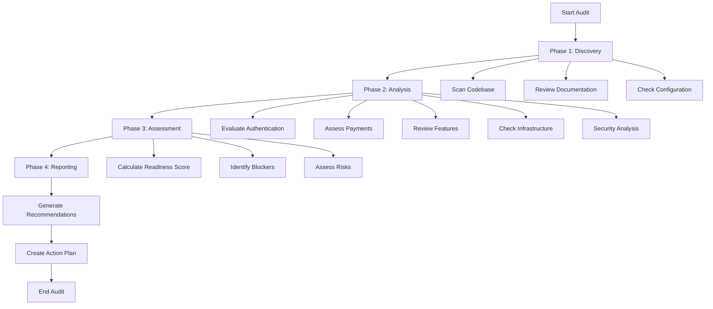

# Platform Readiness Audit - Design Document

## Overview

The Platform Readiness Audit is a comprehensive analysis system that evaluates the Crowe Logic AI platform across 10 critical dimensions to determine launch readiness. The audit will examine existing code, configuration files, documentation, and test coverage to produce a detailed readiness report with actionable recommendations.

This design focuses on creating a systematic, repeatable audit process that can be executed manually by reviewing the codebase and generating a structured report. The audit will identify launch blockers, assess risks, and provide a prioritized roadmap to production deployment.

## Architecture

### Audit Process Flow



### Audit Dimensions

The audit evaluates 10 key dimensions, each with specific evaluation criteria:

1. **Authentication System** (Weight: 15%)
   - Supabase configuration correctness
   - Middleware protection coverage
   - Session management reliability
   - RLS policy completeness

2. **Payment Integration** (Weight: 15%)
   - Stripe configuration completeness
   - Webhook implementation
   - Subscription management
   - Checkout flow completion

3. **Feature Completeness** (Weight: 12%)
   - Core feature implementation status
   - Premium feature availability
   - Feature accessibility by tier

4. **Infrastructure** (Weight: 12%)
   - Environment variable documentation
   - Database schema completeness
   - Deployment configuration
   - Performance optimization

5. **Security** (Weight: 15%)
   - API endpoint protection
   - Input validation
   - Security headers
   - Secrets management

6. **Testing Coverage** (Weight: 10%)
   - Automated test existence
   - Manual testing completion
   - Critical path coverage

7. **Email Notifications** (Weight: 8%)
   - Email service configuration
   - Template completeness
   - Trigger implementation

8. **Documentation** (Weight: 5%)
   - User guides
   - Technical documentation
   - Admin procedures

9. **Launch Readiness** (Weight: 5%)
   - Production checklist completion
   - Monitoring setup
   - Rollback procedures

10. **Risk Analysis** (Weight: 3%)
    - Risk identification
    - Mitigation strategies
    - Contingency planning

## Components and Interfaces

### 1. Code Scanner Component

**Purpose**: Automatically scan the codebase to gather information about implementation status.

**Inputs**:
- Project root directory
- File patterns to scan
- Search criteria

**Outputs**:
- List of files by category
- Configuration file contents
- Code pattern matches

**Key Functions**:
- `scanAuthenticationFiles()`: Find and analyze auth-related files
- `scanAPIRoutes()`: Identify all API endpoints
- `scanComponents()`: List all React components
- `findEnvironmentVariables()`: Extract env var references
- `analyzeMiddleware()`: Review middleware configuration

### 2. Configuration Analyzer Component

**Purpose**: Parse and validate configuration files.

**Inputs**:
- `.env.example` file
- `next.config.mjs` file
- `middleware.ts` file
- `package.json` file

**Outputs**:
- List of required environment variables
- Missing configuration items
- Configuration warnings

**Key Functions**:
- `validateEnvVars()`: Check for required variables
- `analyzeNextConfig()`: Review Next.js settings
- `checkMiddlewareProtection()`: Verify protected routes
- `validateDependencies()`: Check package versions

### 3. Database Schema Validator Component

**Purpose**: Verify database schema completeness and correctness.

**Inputs**:
- SQL migration files
- Database connection (optional)

**Outputs**:
- List of tables and columns
- Missing indexes
- RLS policy status

**Key Functions**:
- `parseSQLFiles()`: Extract schema from SQL files
- `validateTables()`: Check required tables exist
- `checkIndexes()`: Verify performance indexes
- `validateRLS()`: Confirm RLS policies

### 4. Feature Inventory Component

**Purpose**: Catalog all platform features and their implementation status.

**Inputs**:
- App directory structure
- Component files
- API routes

**Outputs**:
- Feature list with status
- Completion percentage
- Missing features

**Key Functions**:
- `inventoryPages()`: List all pages
- `checkAPIEndpoints()`: Verify API completeness
- `assessFeatureStatus()`: Determine implementation level
- `identifyGaps()`: Find missing functionality

### 5. Security Auditor Component

**Purpose**: Identify security vulnerabilities and risks.

**Inputs**:
- API route files
- Middleware configuration
- Database queries

**Outputs**:
- Security findings list
- Vulnerability severity ratings
- Remediation recommendations

**Key Functions**:
- `checkAuthentication()`: Verify auth on endpoints
- `validateInputSanitization()`: Check for injection risks
- `reviewSecurityHeaders()`: Assess header configuration
- `checkSecretsExposure()`: Find exposed secrets

### 6. Test Coverage Analyzer Component

**Purpose**: Evaluate testing completeness.

**Inputs**:
- Test files directory
- Testing checklist document

**Outputs**:
- Test coverage percentage
- Untested critical paths
- Testing gaps

**Key Functions**:
- `scanTestFiles()`: Find all test files
- `calculateCoverage()`: Compute coverage metrics
- `identifyUntested()`: Find untested features
- `reviewManualTests()`: Check manual test completion

### 7. Documentation Reviewer Component

**Purpose**: Assess documentation completeness and quality.

**Inputs**:
- Documentation files
- README files
- Code comments

**Outputs**:
- Documentation inventory
- Missing documentation
- Quality assessment

**Key Functions**:
- `scanDocs()`: Find all documentation
- `checkCompleteness()`: Verify required docs exist
- `assessQuality()`: Evaluate documentation quality
- `identifyGaps()`: Find missing documentation

### 8. Readiness Calculator Component

**Purpose**: Calculate overall launch readiness score.

**Inputs**:
- Results from all audit components
- Dimension weights

**Outputs**:
- Overall readiness score (0-100%)
- Dimension-specific scores
- Launch recommendation

**Key Functions**:
- `calculateDimensionScores()`: Score each dimension
- `applyWeights()`: Apply dimension weights
- `computeOverallScore()`: Calculate final score
- `generateRecommendation()`: Provide launch guidance

### 9. Risk Analyzer Component

**Purpose**: Identify and assess risks.

**Inputs**:
- Audit findings
- Platform architecture
- Business requirements

**Outputs**:
- Risk register
- Risk severity ratings
- Mitigation strategies

**Key Functions**:
- `identifyRisks()`: Find potential risks
- `assessImpact()`: Evaluate risk impact
- `recommendMitigations()`: Suggest mitigations
- `createContingencyPlans()`: Develop backup plans

### 10. Report Generator Component

**Purpose**: Generate comprehensive audit report.

**Inputs**:
- All audit component outputs
- Readiness score
- Risk analysis

**Outputs**:
- Markdown audit report
- Executive summary
- Action plan with priorities

**Key Functions**:
- `generateExecutiveSummary()`: Create high-level overview
- `createDetailedFindings()`: Document all findings
- `prioritizeTasks()`: Order tasks by importance
- `estimateEffort()`: Calculate time requirements

## Data Models

### Audit Result Model

```typescript
interface AuditResult {
  timestamp: Date
  overallScore: number
  dimensionScores: DimensionScore[]
  findings: Finding[]
  risks: Risk[]
  recommendations: Recommendation[]
  actionPlan: ActionItem[]
}
```

### Dimension Score Model

```typescript
interface DimensionScore {
  dimension: string
  weight: number
  score: number
  weightedScore: number
  status: 'excellent' | 'good' | 'needs-work' | 'critical'
  findings: Finding[]
}
```

### Finding Model

```typescript
interface Finding {
  id: string
  dimension: string
  severity: 'critical' | 'high' | 'medium' | 'low'
  category: string
  title: string
  description: string
  location: string // file path or component
  recommendation: string
  estimatedEffort: string // hours
  isBlocker: boolean
}
```

### Risk Model

```typescript
interface Risk {
  id: string
  type: 'technical' | 'business' | 'security' | 'operational'
  severity: 'critical' | 'high' | 'medium' | 'low'
  probability: 'high' | 'medium' | 'low'
  impact: string
  mitigation: string
  contingency: string
}
```

### Action Item Model

```typescript
interface ActionItem {
  id: string
  priority: number
  title: string
  description: string
  dimension: string
  estimatedHours: number
  dependencies: string[]
  isBlocker: boolean
  relatedFindings: string[]
}
```

## Audit Execution Process

### Phase 1: Discovery (2-3 hours)

1. **Codebase Scan**
   - Clone/access repository
   - Scan directory structure
   - Identify key files and components
   - Extract configuration files

2. **Documentation Review**
   - Read all markdown files in root
   - Review docs directory
   - Check for README files
   - Inventory existing documentation

3. **Configuration Extraction**
   - Parse `.env.example`
   - Review `next.config.mjs`
   - Analyze `middleware.ts`
   - Check `package.json` dependencies

### Phase 2: Analysis (4-6 hours)

1. **Authentication Analysis**
   - Review Supabase client setup
   - Check middleware protection
   - Verify session management
   - Validate RLS policies

2. **Payment Assessment**
   - Review Stripe integration
   - Check webhook implementation
   - Verify subscription management
   - Test checkout flows (code review)

3. **Feature Inventory**
   - List all pages and routes
   - Check API endpoints
   - Verify component completeness
   - Assess feature accessibility

4. **Infrastructure Check**
   - Validate environment variables
   - Review database schema
   - Check deployment configuration
   - Assess performance optimizations

5. **Security Audit**
   - Review API authentication
   - Check input validation
   - Verify security headers
   - Scan for exposed secrets

### Phase 3: Assessment (2-3 hours)

1. **Score Calculation**
   - Calculate dimension scores
   - Apply weights
   - Compute overall readiness
   - Determine launch recommendation

2. **Blocker Identification**
   - Identify critical issues
   - Flag launch blockers
   - Prioritize findings
   - Estimate remediation effort

3. **Risk Analysis**
   - Identify potential risks
   - Assess risk severity
   - Recommend mitigations
   - Create contingency plans

### Phase 4: Reporting (2-3 hours)

1. **Report Generation**
   - Create executive summary
   - Document detailed findings
   - Generate action plan
   - Provide recommendations

2. **Deliverables**
   - Comprehensive audit report (Markdown)
   - Executive summary (1-2 pages)
   - Prioritized action plan
   - Risk register

## Scoring Methodology

### Dimension Scoring

Each dimension is scored on a 0-100 scale:

- **90-100**: Excellent - Production ready
- **75-89**: Good - Minor improvements needed
- **60-74**: Needs Work - Significant gaps exist
- **0-59**: Critical - Major issues present

### Scoring Criteria

**Authentication (15% weight)**:
- Supabase SSR correctly implemented: 25 points
- All protected routes secured: 25 points
- Session management working: 25 points
- RLS policies complete: 25 points

**Payment Integration (15% weight)**:
- Stripe fully configured: 30 points
- Webhooks implemented: 30 points
- Subscription management working: 25 points
- Checkout flows complete: 15 points

**Feature Completeness (12% weight)**:
- Core features implemented: 40 points
- Premium features available: 30 points
- Feature accessibility correct: 30 points

**Infrastructure (12% weight)**:
- Environment variables documented: 25 points
- Database schema complete: 25 points
- Deployment configured: 25 points
- Performance optimized: 25 points

**Security (15% weight)**:
- API endpoints protected: 30 points
- Input validation present: 25 points
- Security headers configured: 20 points
- No secrets exposed: 25 points

**Testing Coverage (10% weight)**:
- Automated tests exist: 40 points
- Manual testing complete: 30 points
- Critical paths covered: 30 points

**Email Notifications (8% weight)**:
- Email service configured: 40 points
- Templates complete: 30 points
- Triggers implemented: 30 points

**Documentation (5% weight)**:
- User guides exist: 40 points
- Technical docs complete: 30 points
- Admin procedures documented: 30 points

**Launch Readiness (5% weight)**:
- Production checklist complete: 50 points
- Monitoring configured: 30 points
- Rollback procedures documented: 20 points

**Risk Analysis (3% weight)**:
- Risks identified: 40 points
- Mitigations documented: 30 points
- Contingencies planned: 30 points

### Overall Readiness Interpretation

- **95-100%**: Ready to launch immediately
- **85-94%**: Launch ready with minor polish
- **75-84%**: Launch possible with known risks
- **65-74%**: 1-2 weeks of work needed
- **50-64%**: 2-4 weeks of work needed
- **<50%**: Significant work required (4+ weeks)

## Error Handling

### Missing Files
- Document missing critical files
- Estimate impact on readiness
- Recommend creation priority

### Configuration Errors
- Flag incorrect configurations
- Provide correct examples
- Estimate fix time

### Incomplete Features
- Document incomplete implementations
- Assess impact on user experience
- Recommend completion approach

### Security Vulnerabilities
- Flag as critical findings
- Provide remediation steps
- Recommend immediate action

## Testing Strategy

### Audit Process Testing

1. **Dry Run**: Execute audit on known codebase
2. **Validation**: Compare findings with manual review
3. **Refinement**: Adjust scoring criteria based on results
4. **Documentation**: Document audit process for repeatability

### Report Quality Checks

1. **Completeness**: Verify all dimensions covered
2. **Accuracy**: Validate findings against code
3. **Actionability**: Ensure recommendations are specific
4. **Clarity**: Review report readability

## Deliverables

### 1. Executive Summary (1-2 pages)
- Overall readiness score
- Key findings (top 5)
- Launch recommendation
- Critical blockers
- Estimated time to launch

### 2. Detailed Audit Report (15-25 pages)
- Dimension-by-dimension analysis
- All findings with severity
- Code references and examples
- Specific recommendations
- Risk analysis

### 3. Action Plan (3-5 pages)
- Prioritized task list
- Effort estimates
- Dependencies
- Critical path to launch
- Quick wins

### 4. Risk Register (2-3 pages)
- Identified risks
- Severity and probability
- Mitigation strategies
- Contingency plans
- Monitoring recommendations

## Timeline

- **Phase 1 (Discovery)**: 2-3 hours
- **Phase 2 (Analysis)**: 4-6 hours
- **Phase 3 (Assessment)**: 2-3 hours
- **Phase 4 (Reporting)**: 2-3 hours

**Total Audit Time**: 10-15 hours

## Success Criteria

The audit is successful when:

1. All 10 dimensions have been evaluated
2. Overall readiness score is calculated
3. All critical findings are documented
4. Launch blockers are clearly identified
5. Actionable recommendations are provided
6. Risk analysis is complete
7. Prioritized action plan is delivered
8. Executive summary is clear and concise
